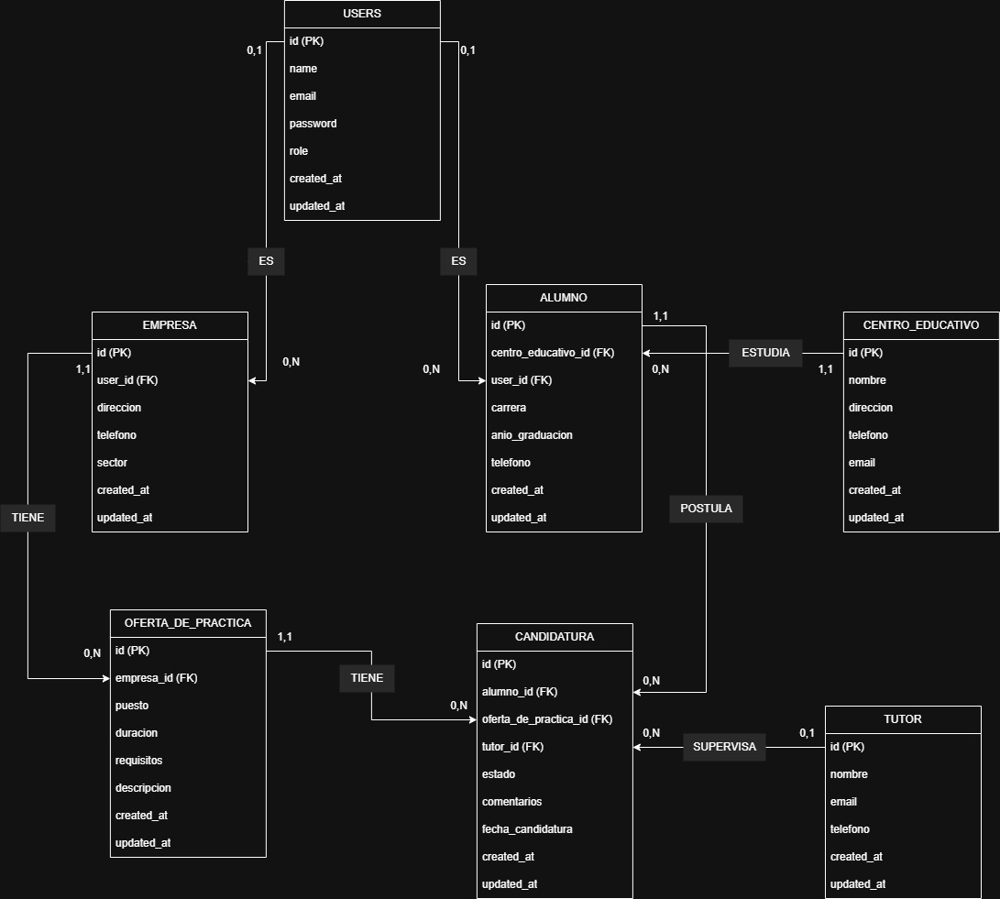

# AD Practica 3
se trata de un proyecto laravel bla bla 


[Tablas en detalle y explicadas](docs/Tablas.md)
<br>
## 1. Descripción del problema


Este proyecto tiene un objetivo de bla bla   
### Tabla General con Campos y Relaciones


| Tabla                  | Relaciones                                     |
|------------------------|----------------------------------------------------------|
| **users**             | HasOne(alumno), HasOne(empresa)               |
| **alumno**            | `BelongsTo(users)`, BelongsTo(centro_educativo), HasMany(candidatura), HasManyThrough(tutor, candidatura) |
| **empresa**           | BelongsTo(users), HasMany(oferta_de_practica) |
| **oferta_de_practica**| BelongsTo(empresa), HasMany(candidatura)      |
| **candidatura**       | BelongsTo(alumno), BelongsTo(oferta_de_practica), BelongsTo(tutor) |
| **centro_educativo**  | HasMany(alumno)                               |
| **tutor**             | HasMany(candidatura)                          |

---

### Relación entre las tablas

1. **Tabla `users`:**
   - Relación **HasOne** con `alumno` y `empresa`.

2. **Tabla `alumno`:**
   - Relación **BelongsTo** con `users`.
   - Relación **BelongsTo** con `centro_educativo`.
   - Relación **HasMany** con `candidatura`.
   - Relación **HasManyThrough** con `tutor` a través de `candidatura`.

3. **Tabla `empresa`:**
   - Relación **BelongsTo** con `users`.
   - Relación **HasMany** con `oferta_de_practica`.

4. **Tabla `oferta_de_practica`:**
   - Relación **BelongsTo** con `empresa`.
   - Relación **HasMany** con `candidatura`.

5. **Tabla `candidatura`:**
   - Relación **BelongsTo** con `alumno`, `oferta_de_practica` y `tutor`.

6. **Tabla `centro_educativo`:**
   - Relación **HasMany** con `alumno`.

7. **Tabla `tutor`:**
   - Relación **HasMany** con `candidatura`.


## 2. Modelo E-R




## 3. Implementación


## 4. WoW (Way of Working)
Comandos para que funcione el proyecto 


```bash
docker run --name mariadb_practicas -e MYSQL_ROOT_PASSWORD=root -e MYSQL_DATABASE=practicas -e MYSQL_USER=usuario -e MYSQL_PASSWORD=pepe123 -p 3306:3306 -d mariadb:latest
  ```
<details>

  <summary>⚠️ ¿Tienes un fallo? Haz clic aquí para ver la solución</summary>

   ---
si el puerto esta ocupado se puede cambiar el puerto de escucha o detener el proceso que ocupa el puerto
para detenerlo en windows 

  **Posibles soluciones:**
  - Asegúrate de haber instalado todas las dependencias con `npm install`.
  - Revisa que el archivo `.env` esté correctamente configurado.
  - Reinicia el servidor con `npm run dev`.
Encuentra el id del proceso
```bash
netstat -ano | findstr 3306
  ```
Detiene el proceso
```bash
Stop-Process -Id NumeroID
  ```
  
 ---
 
</details>


```bash
docker exec -it mariadb_practicas mariadb -u usuario -p
  ```

```bash
copy .env.example .env
  ```


```bash
composer install
  ```
si win da fallos hay que desactivar opcion analisis en tiempo real de Windows Defender


```bash
php artisan key:generate
  ```

```bash

php artisan migrate:fresh
  ```
```bash

php artisan db:seed
  ```
```bash

php artisan serve
  ```


